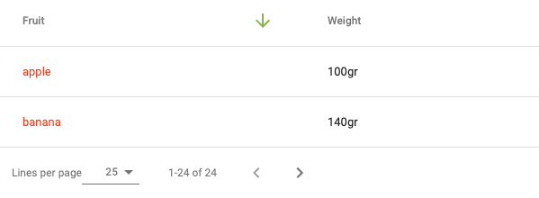

 [](https://www.webcomponents.org/element/@doubletrade/lit-datatable)

# lit-datatable

`lit-datatable` is a material design implementation of a data table.




## Roadmap
Add some helpers.

## Install
```
npm install @doubletrade/lit-datatable
```

## Launch demo
```
npm run serve
```

## Lint
```
npm run lint:javascript
```

## Data
```js
// Data from api
const data = [
  { fruit: 'apple', color: 'green', weight: '100gr' },
  { fruit: 'banana', color: 'yellow', weight: '140gr' }
];
// Conf to set order of column and visibility (can be dynamically)
const conf = [
  { property: 'fruit', header: 'Fruit', hidden: false },
  { property: 'color', header: 'Color', hidden: true },
  { property: 'weight', header: 'Weight', hidden: false }
];
```

## Simple example
```html
<lit-datatable .data="${data}" .conf="${conf}"></lit-datatable>
```
## Simple example with sticky header
```html
<lit-datatable sticky-header .data="${data}" .conf="${conf}"></lit-datatable>
```
## With HTML header
Use native html from lit-html to render a custom header.
Header can use value from data and property from conf.
```js
const headerOfFruit = (value, property) => html`<div style="color: red;">${value}</div>`;
```
```html
<lit-datatable .data="${data}" .conf="${conf}">
  <lit-datatable-column header="${true}" property="fruit" .html="${headerOfFruit}"></lit-datatable-column>
</lit-datatable>
```
## With HTML data
As header, use native html from lit-html to render a custom body.
```js
const bodyOfFruit = (value, property) => html`<div style="color: red;">${value}</div>`;
```
```html
<lit-datatable .data="${data}" .conf="${conf}">
  <lit-datatable-column column="${true}" property="fruit" .html="${bodyOfFruit}"></lit-datatable-column>
</lit-datatable>
```
## With HTML data and footer
A footer is available to catch size and page changed in order to relaunch the request to the backend.
```html
<lit-datatable .data="${data}" .conf="${conf}">
  <lit-datatable-column column="${true}" property="fruit" .html="${bodyOfFruit}"></lit-datatable-column>
</lit-datatable>
<lit-datatable-footer
  @size-changed="${this._handleSizeChanged}"
  @page-changed="${this._handlePageChanged}"
  .availableSize="${[5, 10, 25]}"
  totalPages="10"
  totalElements="24"
  size="25"
  page="0"
  language="en">
</lit-datatable-footer>
```
## With HTML data and sorter
A default sorter is available, set a header column without html and type `sort`. 
The sort must be of the following form : `property,direction`, ex: `fruit,asc`.
```html
<lit-datatable .data="${data}" .conf="${conf}" @sort="${this._sortChanged}" .sort="${sort}">
  <lit-datatable-column header="${true}" property="fruit" type="sort"></lit-datatable-column>
  <lit-datatable-column column="${true}" property="fruit" .html="${bodyOfFruit}"></lit-datatable-column>
</lit-datatable>
```
## With HTML data and custom sorter
You can use a specific sorter is available in helpers.
```js
const sort = key => (value, property) => html`
  <ld-header-with-sort
    language="en"
    data-property="${property}"
    @direction-changed="${this.handleSortChanged.bind(this)}"
    direction="${this._getSortDirection(this.sort, key)}">
    ${value}
  </ld-header-with-sort>`;
```
```html
<lit-datatable .data="${data}" .conf="${conf}">
  <lit-datatable-column header="${true}" property="fruit" .html="${sort}"></lit-datatable-column>
  <lit-datatable-column column="${true}" property="fruit" .html="${bodyOfFruit}"></lit-datatable-column>
</lit-datatable>
```
## Custom style on a td
```html
<lit-datatable-column column="${true}" property="fruit" columnStyle="padding: 0; min-width: initial;"></lit-datatable-column>
```

## With HTML data and filter
```html
<lit-datatable .data="${data}" .conf="${conf}" @filter="${this.filterChanged}">
  <lit-datatable-column header="${true}" property="fruit" type="filter" .filterValue="${this.filter}"></lit-datatable-column>
  <lit-datatable-column column="${true}" property="fruit" .html="${bodyOfFruit}"></lit-datatable-column>
</lit-datatable>
```

## With HTML data, sort and filter
```html
<lit-datatable .data="${data}" .conf="${conf}" @filter="${this.filterChanged}".sort="${this.sort}" @sort="${this.sortChanged}">
  <lit-datatable-column header="${true}" property="fruit" type="filterSort" .filterValue="${this.filter}"></lit-datatable-column>
  <lit-datatable-column column="${true}" property="fruit" .html="${bodyOfFruit}"></lit-datatable-column>
</lit-datatable>
```

## With HTML data and choices filter
```html
<lit-datatable .data="${data}" .conf="${conf}" @choices="${this.choicesChanged}">
  <lit-datatable-column header="${true}" property="fruit" type="choices" .choices="${this.availableChoices}" .selectedChoices="${this.choices}"></lit-datatable-column>
  <lit-datatable-column column="${true}" property="fruit" .html="${bodyOfFruit}"></lit-datatable-column>
</lit-datatable>
```

## With HTML data and choices filter with value filtering
```html
<lit-datatable .data="${data}" .conf="${conf}" @choices="${this.choicesChanged}">
  <lit-datatable-column header="${true}" property="fruit" enableFilter type="choices" .choices="${this.availableChoices}" .selectedChoices="${this.choices}"></lit-datatable-column>
  <lit-datatable-column column="${true}" property="fruit" .html="${bodyOfFruit}"></lit-datatable-column>
</lit-datatable>
```

## With HTML data and date filter
The format of startDate and endDate is a timestamp.
```html
<lit-datatable .data="${data}" .conf="${conf}" @dates="${this.datesChanged}">
  <lit-datatable-column header="${true}" property="fruit" type="dateSort" .start="${this.startDate}" .end="${this.endDate}"></lit-datatable-column>
  <lit-datatable-column column="${true}" property="fruit" .html="${bodyOfFruit}"></lit-datatable-column>
</lit-datatable>
```

---

[](https://saucelabs.com)
